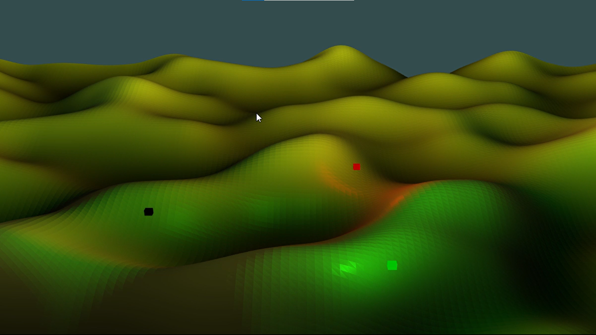

### Ah, yes, a Readme page! I'll start there :wink:

So, what is this? This is me sharing what excites me with you, fellow reader.

We are headed to math models of systems, but there is a bit of journey to get there.

It's interesting as I think about it, because I think my schooling + hobbies shaped this, which I didn't really realize until now.

I guess this would start back in Linear Algebra - I was taking the class and had heard it was an important one, but I wasn't really getting it. We touched on how we could use the math for computer graphics, which sounded neat to me. I mean, how do we represent 3D graphics on a 2D screen... kind of a cool question. Unfortunatley, we didn't really touch on that.

Queue my first co-op, and I had time to start exploring some of the stuff we did in school in a more leisurely setting. this led me into finally learning about computer graphics. I would end up revisiting graphics a number of other times over the years, because it really is **cool**.

<figure align="center">
    

        
        <figcaption>  Frame of an animation I made.
        </figcaption>
    

</figure>

In a similiar domain lays computer music. What interested me, like the computer graphics, was - how can we create music with a computer? 

More specifically, I had dabbled in piano over the years and thought it would interesting to see if I could make piano sounds with computer programming.
