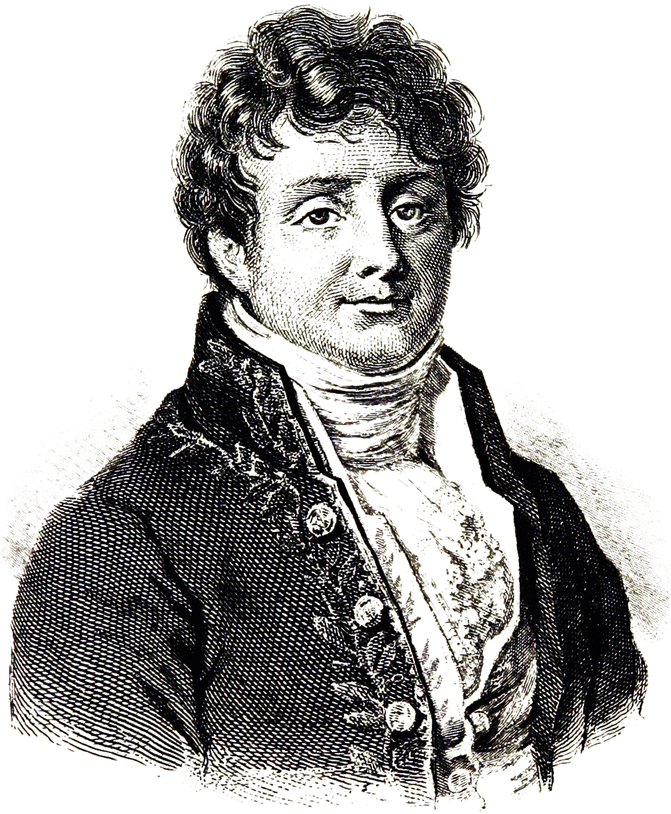

<!--  -->

### Fourier Theorem or: How I Learned to Stop Worrying and Love the Math.

I was in my third year of electrical engineering school when shit hit the fan (again?). It was COVID, online school, minimal social interaction, and some pretty hard engineering courses. 

I'd made it out of the first two years of some pretty hard math, science, and introductory electrical engineering courses, but it was time to get royally fucked once again.

Me, in all of my wisdom, had unknowingly decided to take three of the hardest electrical engineering courses for the Fall: Probability for Engineers, Semiconductor Theory, and Signals and Systems/Transform Methods. You'll just have to take me and my fellow engineers' words for it - these were some pretty hard classes.

The usual symptoms of a crazy quarter of school set in - self doubt, anxiety, hopelessness, etc. etc.

Now, these feelings didn't really go away, but getting through this quarter opened me up to a whole new side of engineering and math that made it all pretty exciting. 

We learned a way to break down complex ideas into simpler ones, which is one of my favorite ways of learning.

I think it was Einstein that said something like, "If you can't explain an idea in a simple way, you don't really understand it."

So how did we do this? What's the magic? 

#### $\rightarrow$ Fourier Theorem.

I think I'll do away with the gritty of the mathematics for now, because this is really about getting excited about the math and then letting the details follow.

Say your teacher says to you:

> I've devised a way for different groups of people to talk to each other from all over the world, without any one voice interfering with another! How did I do it?

You might say back: I think you've bought a cellphone.

 
     

<!--  -->

Well, you'd be right, but he does propose an interesting question - how _do_ two people have a conversation on their phones without another phone conversation interfering with it. It's like asking, if we have many pairs of people talking in the same room to each other, how can they hear each other with all the background noise.

Another way to frame the question, interestingly enough, is: if two people are playing the same note on a piano and a flute, how can we tell the intruments apart? A note is, a note, is a note... right?

Well yes... sort of.

The first step to understanding the difference in sound between two instruments is that we hear sound as a collection of frequencies or tones. The strength of these different tones gives the sound its fingerprint.

Fourier Theorem says this very idea, sound (or really almost any signal) can be composed of tones of different strength.

These tones are sines and cosines.

So let's say middle C on the piano is made up of sine waves or tones with frequencies: $262$, $524$, and $786$ Hz.

Where Hz is just the unit of frequency (how low or high pitched the tone is).

Notes really are made of the same frequencies, so the flute should have the same frequencies. That said, the same notes sound different due to the different _strengths_ of each one.

So our piano might have those tones with strengths (or amplitudes) of $5$, $1$, and $2$, but our flute might have strengths $2$, $4$, and $3$. 

I made those numbers up, but what those numbers would mean is that the piano has a stronger lower frequency component, while the flute has stronger high frequency components.

 
     

We can think of voice audio as the same sort of thing. A set of frequencies with different strengths. To make different sounds these strengths would change over time to form vowels and consanants. Our words are too, just like sounds, a combination of simpler parts. Sounds are a combination of frequencies, and words are a combination of vowels and consanants. 

We can even say that all of the sounds we make are limited to a set of frequencies, just like a C on any instrument is limited to a set of specific frequencies. This range is from around 20 Hz to around 20,000 Hz.

I'm abitrarily drawing this as a blob of frequencies in the allowed range of human hearing/speaking.

 
    

Let's get back to our professors "invention". He said two people can be talking at the same time without their voices interfering.

Suppose we had a very special person that could not only talk above this range, say 25,000 Hz to 45,000 Hz, but they could also only _hear_ at 25,000 Hz and 45,000 Hz.

That would mean our ordinary human could be speaking to our special human, and the special human wouldn't hear them. It would also mean, the special human could also talk while the ordinary human did and they still wouldn't hear each other!

That's what our cellphones do! They tune themselves to listen at a specific set of frequencies (exactly like a radio - as they are radios :) ).

So if we had a way to take a human voice, move its set of frequencies to itw own unique band of frequencies, we could send lots of voice signals at once, and they wouldn't touch each other!

 
    

We can imagine moving our signal from 0 to 20,000 Hz to 80,000 to 100,000 Hz. Cellphones actually operate in the mega- ($10^6$) and giga-($10^9$) hertz range, but we can ignore that for now; it's the same principle.

Phone providers, like Verizon and AT&T, get bands allocated to put their users voice signals, so they don't interfere.

The process for a cellphone signal going from one person to another might look like one person talks into their phone, the phone moves (or modulates to be specific) the signal up to a higher frequency like in the picture, the signal gets sent over the air to the second person, and their phone does the reverse process of moving the signal back to human hearing range.

I've now told you all this, but we haven't touched the _real_ math though. I'm leaving that to you though ;) 

I want this to get you interested in this stuff, as to truly understand the inner workings of this all, Mr. Joseph Fourier is the man who uncovers all of that. It'll use some calculus, imaginary numbers, grit, and practice.

For me, coming to understand Fourier Theorem and some of its truly amazing applications was incredible. 

So much of electrical engineering and modern technology can trace its roots back to Fourier.

He discovered the math that allows us to represent signals as sets of tones, which is used in all of our technology today, from phones, to images and cameras, and even Snapchat filters.

<figure align="center">

<figcaption>  Joseph Fourier, 1768 - 1830 <a href='http://www.cambridgeblog.org/2014/12/joseph-fourier-heat-radiation-and-finding-new-answers/'> (image source).</a>
</figcaption>
</figure>

Breaking down complex ideas into simpler ones, like breaking down complex signals into simpler tones, is a huge idea. It's made me really love electrical engineering as it gives me more tools to have a fundamental understanding of the world around us.